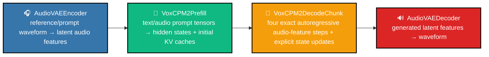
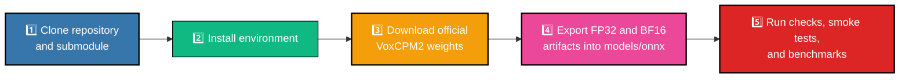

# 🎙️ VoxCPM2 ONNX CPU

 
 
 
 
 


> ✨ CPU-only ONNX Runtime export and runtime workspace for VoxCPM2.


This repository keeps VoxCPM2 neural work in separate ONNX graphs and keeps host responsibilities in Python: text normalization boundary, tokenizer use, WAV I/O, resampling, reference/prompt orchestration, decode loop, stop policy, random diffusion noise, and WAV writing.


## 📚 Contents

- [🚦 Status](#🚦-status)
- [🧠 Architecture](#🧠-architecture)
- [🗂️ Repository Layout](#🗂️-repository-layout)
- [🚀 From Fresh Clone To Exported Models](#🚀-from-fresh-clone-to-exported-models)
- [🔊 Synthesize WAV](#🔊-synthesize-wav)
- [📊 Benchmark And Profile](#📊-benchmark-and-profile)
- [🧪 Development Checks](#🧪-development-checks)
- [📖 Documentation](#📖-documentation)


## 🚦 Status

| Area | Status |
|---|---|
| Target model | VoxCPM2 |
| Runtime target | ONNX Runtime CPU only |
| Platforms | macOS arm64, Linux x86_64 / arm64, Windows x86_64 / arm64 |
| V1 modes | text-to-speech, voice design, controllable clone, ultimate clone |
| Deferred | streaming |
| Precision targets | production FP32 correctness anchor and production BF16 performance target |
| Non-goals | GPU/CoreML/CUDA/DirectML/MPS, quantization, monolithic ONNX graph |


## 🧠 Architecture

The runtime is split into four ONNX modules:



Host code owns everything that is not neural module execution:

- text normalization boundary and tokenizer-driven sequence assembly
- WAV reading/writing and resampling
- reference and prompt-audio path construction
- decode loop and stop policy
- fixed-capacity cache mutation between decode chunks
- NumPy random diffusion noise

The full contract is in [docs/architecture.md](docs/architecture.md)


## 🗂️ Repository Layout

```text
.
├── src/
│   ├── export/        # PyTorch -> ONNX export wrappers and precision profiles
│   ├── runtime/       # CPU-only ONNX Runtime session factory and pipeline
│   ├── cli/           # synthesis CLI
│   ├── bench/         # quick official/API vs ONNX benchmark
│   ├── parity/        # official generate-path tracing
│   └── contracts/     # typed module-boundary schemas
├── tools/
│   ├── bench/         # production baseline and ORT session sweep runners
│   └── profile/       # ORT profiling and Cast-summary tools
├── tests/
│   ├── export/        # export contract and dtype cleanup tests
│   ├── parity/        # PyTorch-wrapper vs ONNX Runtime parity checks
│   └── smoke/         # CPU-only runtime smoke checks
├── docs/              # self-contained project documentation
├── third_party/       # local VoxCPM submodule checkout
├── models/            # local ONNX exports and optional HF snapshots
└── artifacts/         # local reports, logs, WAVs, traces, and benchmark outputs
```

`third_party/`, `models/`, `artifacts/`, `traces/`, and `.venv/` are local/generated state and are ignored by git.


## 🚀 From Fresh Clone To Exported Models

The complete path from a clean clone to ready ONNX models is:


1. Clone repository and submodule.
2. Create Python environment and install dependencies.
3. Download official VoxCPM2 weights.
4. Export FP32 and BF16 ONNX artifacts into `models/onnx`.
5. Run graph checks, parity checks, smoke synthesis, and benchmarks.

### 1️⃣ Clone

```bash
git clone --recursive <repo-url> voxcpm2-onnx-cpu
cd voxcpm2-onnx-cpu
```

If the repository is already cloned or `third_party/VoxCPM` was deleted:

```bash
git submodule update --init --recursive
```

`source setup.sh <mode>` also tries to restore the submodule if it is missing.

### 2️⃣ Install Environment

Use Python `3.11`, `3.12`, or `3.13`. Python `3.12` is the locally used baseline.

Base mode installs runtime plus export/parity dependencies:

```bash
source setup.sh base
```

Development mode adds pytest and ruff:

```bash
source setup.sh dev
```

The script:

- creates `.venv`
- activates it in the current shell
- installs this project in editable mode
- initializes `third_party/VoxCPM` if missing
- installs `third_party/VoxCPM` in editable mode with `--no-deps`

Manual Windows PowerShell equivalent:

```powershell
py -3.12 -m venv .venv
.\.venv\Scripts\Activate.ps1
python -m pip install --upgrade "pip>=24,<26" "setuptools>=70,<81" "wheel>=0.43,<1"
git submodule update --init --recursive
python -m pip install -e ".[export]"
python -m pip install -e "third_party/VoxCPM" --no-deps

# Developer tools:
python -m pip install -e ".[export,dev]"
```

### 3️⃣ Download VoxCPM2 Weights

Download weights into the Hugging Face cache:

```bash
python -c "from voxcpm import VoxCPM; VoxCPM.from_pretrained('openbmb/VoxCPM2', load_denoiser=False)"
```

Export scripts default to local files only. If a script should fetch missing files directly, pass `--allow-download`.

### 4️⃣ Export ONNX Models

Export production FP32:

```bash
python -B src/export/export_all.py --precision fp32
```

Export production BF16:

```bash
python -B src/export/export_all.py --precision bf16
```

BF16 export applies an ORT CPU compatibility pass automatically. The pass keeps the same public graph contract and inserts explicit FP32 islands only for BF16 op types that stock ONNX Runtime CPU cannot load or run. If you already have stale BF16 artifacts from an older export, patch them in place instead of re-exporting:

```bash
python -B src/export/patch_bf16_ort_cpu.py --root models/onnx
```

Production exports use the shared `production` shape profile for both precision families:

| bound | default |
|---|---:|
| batch | `1` static |
| prefill sequence | `1024` tokens/audio positions |
| decode cache capacity | `6144` positions |
| AudioVAE encoder samples | `960000` padded samples |
| AudioVAE decoder latent steps | `16384` |

Use the same flags for FP32 and BF16 if you need larger production bounds:

```bash
python -B src/export/export_all.py \
  --precision fp32 \
  --max-seq-len 1536 \
  --max-cache-seq-bound 7680
```

When runtime bounds differ from defaults, pass matching CLI bounds at synthesis/benchmark time. This keeps one runtime implementation while making shape limits explicit.

Expected output layout:

```text
models/
└── onnx/
    ├── fp32/
    │   ├── audio_vae_encoder/
    │   │   ├── audio_vae_encoder.onnx
    |   |   └── audio_vae_encoder.onnx.data
    │   ├── audio_vae_decoder/
    │   │   ├── audio_vae_decoder.onnx
    |   |   └── audio_vae_decoder.onnx.data
    │   ├── prefill/
    │   │   ├── voxcpm2_prefill.onnx
    |   |   └── voxcpm2_prefill.onnx.data
    │   └── decode_chunk/
    │       ├── voxcpm2_decode_chunk.onnx
    |       └── voxcpm2_decode_chunk.onnx.data
    └── bf16/
        └── ...
```

Large `.onnx.data` files must stay next to their `.onnx` files.

Module-level exports example for FP32 version:

```bash
############################
# Example for fp32 version #
############################

# audio_vae_encoder
python -B src/export/export_audio_vae_encoder.py --precision fp32
# audio_vae_decoder
python -B src/export/export_audio_vae_decoder.py --precision fp32
# prefill
python -B src/export/export_prefill.py --precision fp32 --mode plain_tts
# decode_chunk
python -B src/export/export_decode_chunk.py --precision fp32 --chunk-size 4 --current-length 16 --max-cache-seq 64

############################
# Example for bf16 version #
############################

# audio_vae_encoder
python -B src/export/export_audio_vae_encoder.py --precision bf16
# audio_vae_decoder
python -B src/export/export_audio_vae_decoder.py --precision bf16
# prefill
python -B src/export/export_prefill.py --precision bf16 --mode plain_tts
# decode_chunk
python -B src/export/export_decode_chunk.py --precision bf16 --chunk-size 4 --current-length 16 --max-cache-seq 64
```

### 5️⃣ Validate Exported Graphs

Path-based ONNX checker plus one ORT CPU run per module:

```bash
############################
# Example for fp32 version #
############################

# audio_vae_encoder
python -B src/runtime/run_audio_vae_encoder_ort.py --onnx-path models/onnx/fp32/audio_vae_encoder/audio_vae_encoder.onnx
# audio_vae_decoder
python -B src/runtime/run_audio_vae_decoder_ort.py --onnx-path models/onnx/fp32/audio_vae_decoder/audio_vae_decoder.onnx
# prefill
python -B src/runtime/run_prefill_ort.py --onnx-path models/onnx/fp32/prefill/voxcpm2_prefill.onnx --mode plain_tts
# decode_chunk
python -B src/runtime/run_decode_chunk_ort.py --onnx-path models/onnx/fp32/decode_chunk/voxcpm2_decode_chunk.onnx --chunk-size 4 --cache-seq 16 --max-cache-seq 64

############################
# Example for bf16 version #
############################

# audio_vae_encoder
python -B src/runtime/run_audio_vae_encoder_ort.py --onnx-path models/onnx/bf16/audio_vae_encoder/audio_vae_encoder.onnx
# audio_vae_decoder
python -B src/runtime/run_audio_vae_decoder_ort.py --onnx-path models/onnx/bf16/audio_vae_decoder/audio_vae_decoder.onnx
# prefill
python -B src/runtime/run_prefill_ort.py --onnx-path models/onnx/bf16/prefill/voxcpm2_prefill.onnx --mode plain_tts
# decode_chunk
python -B src/runtime/run_decode_chunk_ort.py --onnx-path models/onnx/bf16/decode_chunk/voxcpm2_decode_chunk.onnx --chunk-size 4 --cache-seq 16 --max-cache-seq 64
```

Parity against PyTorch export wrappers:

```bash
# audio_vae_encoder
python -B tests/parity/test_audio_vae_encoder.py --onnx-path models/onnx/fp32/audio_vae_encoder/audio_vae_encoder.onnx
# audio_vae_decoder
python -B tests/parity/test_audio_vae_decoder.py --onnx-path models/onnx/fp32/audio_vae_decoder/audio_vae_decoder.onnx
# prefill
python -B tests/parity/test_prefill.py --onnx-path models/onnx/fp32/prefill/voxcpm2_prefill.onnx
# decode_chunk
python -B tests/parity/test_decode_chunk.py --onnx-path models/onnx/fp32/decode_chunk/voxcpm2_decode_chunk.onnx --precision fp32 --chunk-size 4 --cache-seq 16 --max-cache-seq 64
```

CPU-only runtime smoke:

```bash
# Expected after models exist: cpu_only_runtime_smoke=ok
python -B tests/smoke/test_cpu_only_runtime.py
```


## 🔊 Synthesize WAV

Text-only:

```bash
python -B src/cli/synthesize.py \
  --text "Hello from VoxCPM2." \
  --output artifacts/samples/text_only.wav \
  --mode text_only
```

Voice design:

```bash
python -B src/cli/synthesize.py \
  --text "Hello from VoxCPM2." \
  --output artifacts/samples/voice_design.wav \
  --mode voice_design \
  --voice-design "calm voice"
```

Clone modes require `--reference-wav`. Ultimate clone also requires `--prompt-wav` and `--prompt-text`. Parameter `--max-steps 0` is the default and means "run until `stop_logits` ends the stream" with an internal safety cap. `--max-steps 1 --min-steps 0` is only for graph-load smoke checks and writes intentionally truncated audio.

If you exported larger shape bounds, pass matching runtime bounds:

```bash
python -B src/cli/synthesize.py \
  --text "Hello from VoxCPM2." \
  --output artifacts/samples/text_only.wav \
  --max-prefill-seq-len 1536 \
  --max-decode-cache-seq 7680
```


## 📊 Benchmark And Profile

Quick comparison:

```bash
python -B src/bench/compare_pipelines.py \
  --text "Hello from VoxCPM2." \
  --output-dir artifacts/bench \
  --report-json artifacts/bench/report.json \
  --variants orig onnx_fp32 onnx_bf16
```

ORT session sweep for the shared FP32/BF16 production runtime:

```bash
python -B tools/bench/sweep_ort_config.py \
  --output-dir artifacts/ort_session_sweep \
  --json-report artifacts/ort_session_sweep/ort_session_sweep.json \
  --markdown-report artifacts/ort_session_sweep/ort_session_sweep.md \
  --precisions fp32 bf16 \
  --cases text_only_short voice_design_short \
  --config-preset focused \
  --repeats 1 \
  --max-steps 8 \
  --min-steps 8
```

Production baseline matrix:

```bash
python -B tools/bench/run_benchmarks.py \
  --output-dir artifacts/perf_baseline \
  --json-report artifacts/perf_baseline/baseline.json \
  --markdown-report artifacts/perf_baseline/baseline.md \
  --variants official onnx \
  --repeats 3
```

ORT node profiling:

```bash
python -B tools/profile/run_profiled_bench.py \
  --output-dir artifacts/profile \
  --cases controllable_clone_short \
  --top-n 20
```

Cast and dtype cleanup summary:

```bash
python -B tools/profile/summarize_dtype_casts.py \
  --after-root models/onnx \
  --profile-json artifacts/profile/parsed_hotspots.json \
  --json-report artifacts/reports/dtype_cleanup_casts.json \
  --markdown-report artifacts/reports/dtype_cleanup_casts.md
```

Benchmark details are in [docs/benchmarking.md](docs/benchmarking.md)

BF16 is the ONNX performance target because official VoxCPM2 also runs the model in bfloat16. Current stock ONNX Runtime CPU lacks BF16 kernels for several hot operators in the exported graphs, so BF16 artifacts use documented compatibility islands until those kernels or a custom provider are available. Treat benchmark output as the source of truth for whether a local ORT build beats the official API.

The default production ORT session policy is shared by FP32 and BF16:
`graph_optimization=all`, `execution=sequential`, `intra_op_threads=8`, `inter_op_threads=1`,
and ORT memory pattern / CPU arena / memory reuse enabled. Use the sweep command above before changing it.


## 🧪 Development Checks

These checks work on a clean checkout before model export:

```bash
ruff format .
ruff check .
python -B -m compileall -q src tests tools
python -B -m pytest
```

The full pytest suite skips model-dependent smoke/parity checks when ONNX artifacts are absent.

Check runtime stays free of PyTorch:

```bash
rg -n "\btorch\b|import torch|from torch|soundfile|librosa|transformers" src/runtime src/cli tests/smoke
```


## 📖 Documentation

- [docs/architecture.md](docs/architecture.md): feature matrix, traced generate path, module boundaries, runtime contract, fixed cache, platform and dependency rules.
- [docs/exporting.md](docs/exporting.md): export contract, artifact layout, module blockers, checker commands, parity commands.
- [docs/precision.md](docs/precision.md): FP32/BF16 policy, BF16 compute regions, dtype cleanup, legacy storage-only BF16 experiment.
- [docs/benchmarking.md](docs/benchmarking.md): benchmark matrix, ORT tuning, profiling, hotspot interpretation.
