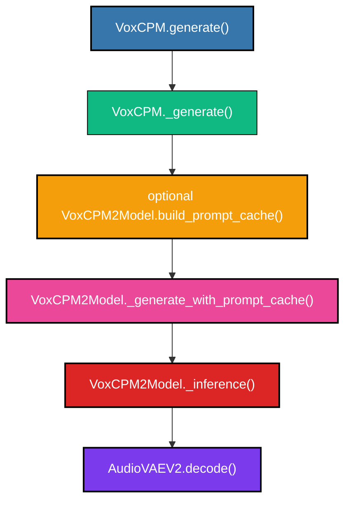
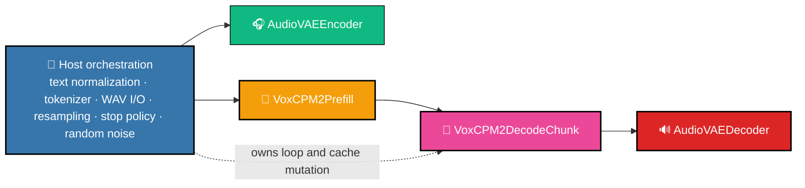
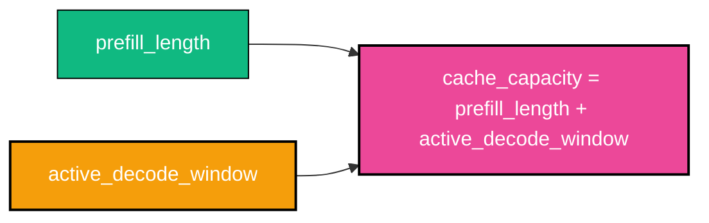

# 🏗️ Architecture And Runtime Contract

## 🎯 Scope

- Model: VoxCPM2.
- Runtime: ONNX Runtime `CPUExecutionProvider` only.
- Platforms: macOS arm64, Linux x86_64 / arm64, Windows x86_64 / arm64.
- V1 modes: text-to-speech, voice design, controllable clone, ultimate clone.
- Deferred: streaming.

"Fully ONNX" means every neural module needed by the supported modes is exported to ONNX. Text normalization, tokenization, WAV I/O, resampling, random noise creation, orchestration, stop policy, and WAV writing remain host code.

## 📋 Feature Matrix

| Feature | V1 status | Requirement |
|---|---|---|
| Text-to-speech | required | Neural work in ONNX; host code handles text and loop orchestration. |
| Voice design | required | Preserve the official VoxCPM2 path; style text remains part of host token assembly. |
| Controllable clone | required | Preserve reference-audio path. |
| Ultimate clone | required | Preserve reference and prompt-audio path. |
| Multilingual path | required | Do not hardcode language. |
| FP32 | required | Correctness anchor and production artifact family. |
| BF16 | required | Parallel production artifact family with the same runtime path and feature coverage. |
| Streaming | v2 | No v1 export/runtime requirement. |
| Quantization | non-goal | Not part of v1. |
| GPU/CoreML/CUDA/DirectML/MPS | non-goal | CPU provider only. |
| Single merged ONNX graph | non-goal | Keep module boundaries separate. |

## 🧭 Official Generate Path

The traced official path is:



Mode mapping:

- `text_only`: no prompt cache, equivalent to the plain zero-shot path.
- `voice_design`: same tensor structure as text-only; design text is encoded in the text prompt.
- `controllable_clone`: `reference_wav_path` activates reference prefix construction.
- `ultimate_clone`: `reference_wav_path` plus `prompt_wav_path`/`prompt_text` activates continuation-style prompt assembly.

Use the trace tool before changing module boundaries:

```bash
python -B src/parity/trace_generate.py \
  --model-path openbmb/VoxCPM2 \
  --mode plain_tts \
  --text "Hello from VoxCPM2." \
  --trace-output traces/plain_tts.jsonl
```

Trace output is compact JSONL with stage names, Python module/function names, shapes, dtypes, and reference/prompt path flags. Full tensor values are never logged.

## 🧩 Module Boundaries

The runtime uses four separate ONNX sessions.


### `AudioVAEEncoder`

Purpose: reference/prompt waveform to latent audio features.

- input `waveform`: `float32[batch, 1, samples]`
- output `latent`: `float32[batch, 64, latent_steps]`

Host code loads WAV, converts to mono, resamples to the model encode rate, pads samples to `audio_vae.chunk_size`, and reshapes the latent into `[audio_steps, patch_size=4, feat_dim=64]` for prompt assembly.

### `VoxCPM2Prefill`

Purpose: full prompt pass over text/audio-aligned sequence.

Inputs:

- `text_tokens`: `int64[batch, seq]`
- `text_mask`: `float32[batch, seq]`
- `audio_features`: `float32[batch, seq, patch_size=4, feat_dim=64]`
- `audio_mask`: `float32[batch, seq]`

Outputs:

- `lm_hidden`: `float32[batch, hidden]`
- `residual_hidden`: `float32[batch, hidden]`
- `prefix_feat_cond`: `float32[batch, patch_size, feat_dim]`
- `base_k_cache`, `base_v_cache`, `base_cache_length`
- `residual_k_cache`, `residual_v_cache`, `residual_cache_length`

Mode-specific assembly is host-side:

- `text_only`: target text plus audio-start control tokens; no audio mask positions.
- `voice_design`: same structure as text-only; design text goes through tokenizer.
- `controllable_clone`: host prepends reference audio marker/features.
- `ultimate_clone`: host combines reference prefix with prompt text/audio continuation.

### `VoxCPM2DecodeChunk`

Purpose: a fixed-size chunk of exact autoregressive audio-feature steps. The outer decode loop and stop policy stay in host code.

Inputs:

- `lm_hidden`: `float32[batch, hidden]`
- `residual_hidden`: `float32[batch, hidden]`
- `prefix_feat_cond`: `float32[batch, patch_size, feat_dim]`
- fixed-capacity base/residual K/V caches
- `base_current_length`, `residual_current_length`: `int64[1]`
- `diffusion_noise`: `float32[chunk_size=4, batch, feat_dim, patch_size]`
- `cfg_value`: `float32[1]`

Outputs:

- `pred_audio_feature`: `float32[batch, chunk_size=4, patch_size, feat_dim]`
- `decoder_latent`: `float32[batch, feat_dim, chunk_size * patch_size]`
- `stop_logits`: `float32[batch, chunk_size=4, 2]`
- next hidden states and prefix feature condition
- chunk K/V updates and next cache lengths

The graph owns four exact neural steps by default: DiT conditioning, fixed-size CFM/LocDiT solve, feature encode, base LM step, residual LM step, stop head, and tensor state outputs. The internal step math is shared with the one-step export utility; no solver schedule or hidden math changes.

`VoxCPM2DecodeStep` remains available as an internal export/parity utility. It is not the production runtime path.

### `AudioVAEDecoder`

Purpose: generated latent feature sequence to waveform.

- input `latent`: `float32[batch, 64, latent_steps]`
- input `sr_cond`: `int32[batch]`
- output `waveform`: `float32[batch, 1, samples]`

For non-streaming v1, host concatenates generated features and calls the decoder once.

## Production Shape Policy

The production export profile specializes shapes that are already fixed by the CPU-only runtime while keeping real text/reference/prompt lengths dynamic within documented bounds.

| Axis | Production policy | Rationale |
|---|---:|---|
| batch | static `1` | The v1 synthesis pipeline is single-request and indexes one waveform result. |
| Prefill `seq` | dynamic, bounded to `1024` by default | Text, reference audio, and prompt audio vary per request but should fail early if they exceed the exported contract. |
| Decode cache `max_cache_seq` | dynamic, bounded to `6144` by default | The host owns fixed-capacity cache allocation; the bound covers default auto decode plus typical prompt/reference inputs. |
| AudioVAE encoder samples | dynamic, bounded to `960000` padded samples | Reference/prompt WAV length remains variable but bounded. |
| AudioVAE decoder latent steps | dynamic, bounded to `16384` | Covers the default decode safety cap with `patch_size=4`. |

The same shape profile applies to FP32 and BF16. If a deployment needs longer prompts or decode limits, re-export both precision profiles with larger bounds and pass matching runtime bounds. This changes the shape contract, not the runtime implementation.

## 🗃️ Fixed-Capacity Decode Cache

The old experimental decode-step contract grew cache tensors every step:


The production contract uses fixed-capacity tensors per decode chunk. For
`max_steps=0`, the safety cap is not treated as the initial cache size; runtime
starts with a bounded cache window and grows by blocks only if stop logits do
not arrive before the current capacity is exhausted.



Input cache shapes:

```text
base_k_cache     : [base_layers, batch, kv_heads, max_cache_seq, head_dim]
base_v_cache     : [base_layers, batch, kv_heads, max_cache_seq, head_dim]
residual_k_cache : [residual_layers, batch, kv_heads, max_cache_seq, head_dim]
residual_v_cache : [residual_layers, batch, kv_heads, max_cache_seq, head_dim]
```

Production decode-chunk output update shapes:

```text
base_k_update     : [base_layers, batch, kv_heads, chunk_size, head_dim]
base_v_update     : [base_layers, batch, kv_heads, chunk_size, head_dim]
residual_k_update : [residual_layers, batch, kv_heads, chunk_size, head_dim]
residual_v_update : [residual_layers, batch, kv_heads, chunk_size, head_dim]
```

Host update rule:

```text
base_k_cache[:, :, :, base_current_length:base_current_length + accepted_steps, :] = base_k_update[:, :, :, :accepted_steps, :]
base_v_cache[:, :, :, base_current_length:base_current_length + accepted_steps, :] = base_v_update[:, :, :, :accepted_steps, :]
residual_k_cache[:, :, :, residual_current_length:residual_current_length + accepted_steps, :] = residual_k_update[:, :, :, :accepted_steps, :]
residual_v_cache[:, :, :, residual_current_length:residual_current_length + accepted_steps, :] = residual_v_update[:, :, :, :accepted_steps, :]
```

The traffic goal is to remove output-cache growth and amortize Python/ORT session boundary overhead. Old grow-by-concat output payload per step was `2 * K * (S + 1)`. The chunked fixed-cache payload per session is `2 * K * chunk_size`, where `K = (base_layers + residual_layers) * batch * kv_heads * head_dim`.

For auto-stop requests, the runtime default is:

```text
decode_auto_initial_steps = 16
decode_cache_growth_steps = 64
decode_safety_max_steps   = 4096
```

This avoids passing thousands of unused KV-cache positions into every
`decode_chunk` call for short sentences. Explicit `--max-steps N` still uses `N`
as the requested upper bound.

## 🛡️ Runtime Rules

- Use only `CPUExecutionProvider`.
- Do not fall back to CUDA, CoreML, DirectML, MPS, or any accelerator provider.
- Load sessions lazily.
- Keep ONNX external-data files next to their `.onnx` files.
- Prefer sibling `.ort` files when they exist and validate cleanly.
- For very large graphs, allow sibling `*.optimized.onnx` artifacts as an
  explicit startup-latency fallback when the current ORT build cannot serialize
  a valid heavy `.ort` file.
- Fail fast with actionable errors for missing modules or external data.
- Do not change model math in runtime code.
- Do not insert silent runtime precision conversions.
- FP32 and BF16 select different artifact paths, not different runtime semantics.

Default ORT CPU session policy is shared by FP32 and BF16:

```text
graph_optimization_level=all
execution_mode=sequential
log_severity_level=error
intra_op_num_threads=8
inter_op_num_threads=1
enable_mem_pattern=true
enable_cpu_mem_arena=true
enable_mem_reuse=true
```

This is a production default, not a separate precision profile. If future benchmark data proves a materially better setting for one precision, the override must be documented in `docs/benchmarking.md` and must keep the same runtime implementation.

## 🔎 Runtime Dependency Audit

Runtime path:

- `src/runtime/session_factory.py`
- `src/runtime/pipeline.py`
- `src/cli/synthesize.py`
- `tests/smoke/test_cpu_only_runtime.py`

Allowed runtime dependencies are Python, NumPy, SciPy, `tokenizers`, `huggingface_hub`, and ONNX Runtime. Runtime orchestration must not import PyTorch, Transformers, `soundfile`, or `librosa`.

PyTorch is allowed only in:

- `src/export/*`
- `tests/parity/*`
- upstream reference code in `third_party/VoxCPM`

Audit command:

```bash
rg -n "\btorch\b|import torch|from torch|soundfile|librosa|transformers" src/runtime src/cli tests/smoke
```

Expected result: no runtime dependency imports. Provider names may appear only in explicit forbidden-provider validation.

## 🖥️ Platform Signoff

For each target platform class, run:

```bash
python -B -m py_compile src/runtime/session_factory.py src/runtime/pipeline.py src/cli/synthesize.py tests/smoke/test_cpu_only_runtime.py
python -B tests/smoke/test_cpu_only_runtime.py
python -B src/cli/synthesize.py --text "Hello from VoxCPM2." --output artifacts/samples/runtime_sample.wav --mode text_only
rg -n "CUDAExecutionProvider|CoreMLExecutionProvider|MPSExecutionProvider|DirectMLExecutionProvider" src/runtime src/cli tests/smoke
```

Expected results:

- smoke prints `cpu_only_runtime_smoke=ok`
- CLI writes a WAV file
- every ORT session reports only `CPUExecutionProvider`

## ✅ Acceptance Criteria

- Every required mode maps to export and runtime orchestration requirements.
- Host/ONNX boundaries match `src/contracts/module_schemas.py`.
- Runtime validates ONNX paths before synthesis.
- Decode-chunk state uses fixed-capacity cache tensors.
- Multilingual and reference-audio paths remain active.
- FP32 and BF16 artifacts use the same runtime path.
- Missing model files, incompatible opset/runtime versions, and shape/dtype mismatches fail with actionable errors.
