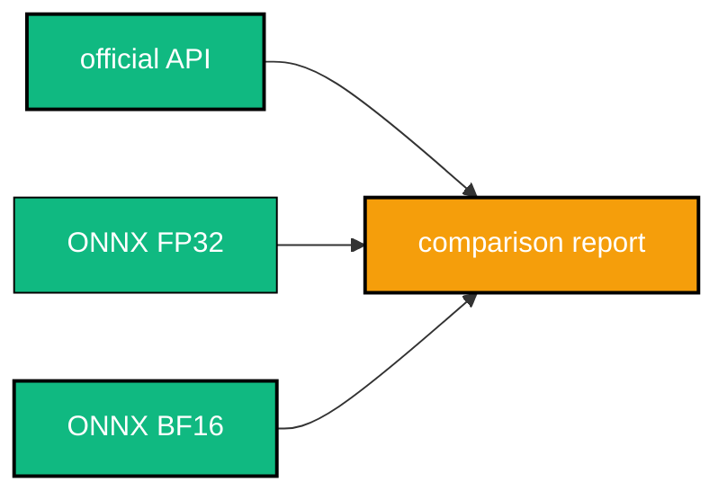
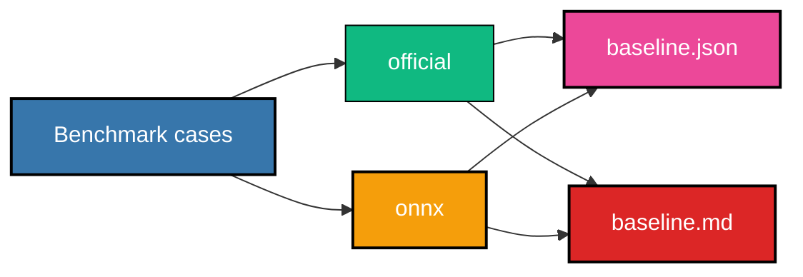
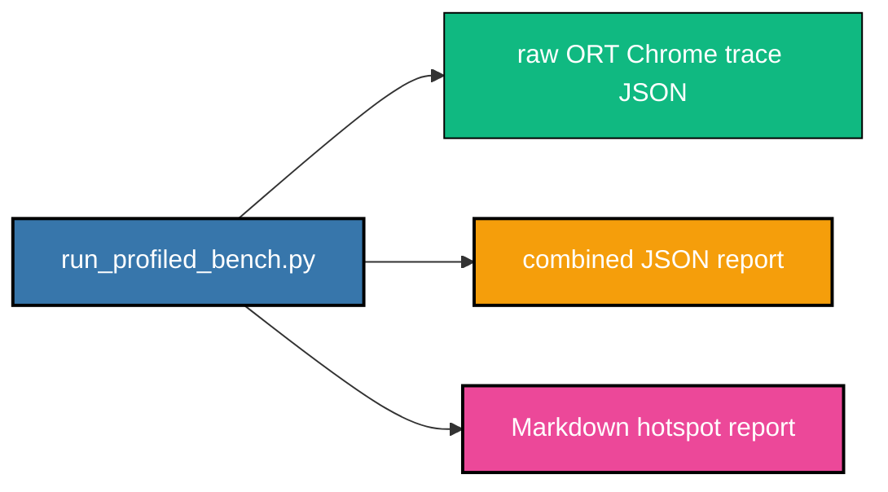

# 📊 Benchmarking And Profiling

## 📏 Rules

Benchmarking and profiling are measurement-only. They must not change:

- model math
- export wrappers
- ONNX graph files
- runtime stop policy
- runtime cache/state semantics
- FP32/BF16 precision policy

## 🎛️ Runtime Tuning Knobs

All options keep `CPUExecutionProvider` only.

| option | values |
|---|---|
| graph optimization | `disable`, `basic`, `extended`, `all` |
| execution mode | `sequential`, `parallel` |
| log severity | `verbose`, `info`, `warning`, `error`, `fatal` |
| intra-op threads | integer or ORT default |
| inter-op threads | integer or ORT default |
| memory pattern | enabled, disabled, or ORT default |
| CPU memory arena | enabled, disabled, or ORT default |
| memory reuse | enabled, disabled, or ORT default |
| shape bounds | must match the exported production shape profile |

Current production defaults are shared by FP32 and BF16 artifacts:

```text
graph_optimization_level=all
execution_mode=sequential
log_severity_level=error
intra_op_num_threads=8
inter_op_num_threads=1
enable_mem_pattern=true
enable_cpu_mem_arena=true
enable_mem_reuse=true
```

These are one runtime path, not precision-specific forks. Precision-specific overrides are allowed only if a session sweep shows a repeatable improvement above the configured threshold.

Why this default is used now:

- local voice-design benchmark with conservative ORT settings measured ONNX FP32 at roughly `478.9 s` synthesis time
- the same workload with `graph_optimization=all`, `execution=sequential`, `intra=8`, `inter=1` measured ONNX FP32 at roughly `80.0 s`
- BF16 storage/compute artifacts must still load successfully under ORT CPU before a BF16-specific recommendation is accepted
- if a BF16 graph fails to load because an op lacks BF16 CPU support, the sweep records the failure and the runtime default stays common

The benchmark CLI preloads selected ONNX sessions during the load phase by default. Use `--no-onnx-preload-sessions` only when measuring first-request latency.

If ONNX artifacts were exported with non-default shape bounds, pass the same runtime bounds to benchmark/profile commands:

```bash
--max-prefill-seq-len 1536 --max-decode-cache-seq 7680
```

## ⚡ Quick Variant Benchmark



Compare official API, ONNX FP32, and ONNX BF16:

```bash
python -B src/bench/compare_pipelines.py \
  --text "Hello from VoxCPM2." \
  --output-dir artifacts/bench \
  --report-json artifacts/bench/report.json \
  --variants orig onnx_fp32 onnx_bf16
```

Voice design with explicit ORT settings:

```bash
python -B src/bench/compare_pipelines.py \
  --text "Hello from VoxCPM2." \
  --mode voice_design \
  --voice-design "pretty girl with sugar voice, slow" \
  --output-dir artifacts/bench_ort_tuned \
  --report-json artifacts/bench_ort_tuned/report.json \
  --variants onnx_fp32 onnx_bf16 \
  --onnx-graph-optimization all \
  --onnx-execution-mode sequential \
  --onnx-log-severity error \
  --onnx-intra-op-threads 8 \
  --onnx-inter-op-threads 1
```

The benchmark prints readable console output and writes JSON. It records WAV path, load time, synthesis time, total time, sample rate, sample count, output duration, peak, RMS, decode steps, and stop reason.

## 🎚️ ORT Session Config Sweep

Run the focused sweep across the current FP32 and BF16 production artifacts:

```bash
python -B tools/bench/sweep_ort_config.py \
  --output-dir artifacts/ort_session_sweep \
  --json-report artifacts/ort_session_sweep/ort_session_sweep.json \
  --markdown-report artifacts/ort_session_sweep/ort_session_sweep.md \
  --precisions fp32 bf16 \
  --cases text_only_short voice_design_short \
  --config-preset focused \
  --repeats 1 \
  --max-steps 8 \
  --min-steps 8
```

Fast smoke of only the current recommended config:

```bash
python -B tools/bench/sweep_ort_config.py \
  --output-dir artifacts/ort_session_sweep_smoke \
  --config-preset recommended \
  --precisions fp32 bf16 \
  --cases text_only_short \
  --max-steps 1 \
  --min-steps 0
```

Full cartesian sweep, when runtime is acceptable:

```bash
python -B tools/bench/sweep_ort_config.py \
  --output-dir artifacts/ort_session_sweep_full \
  --config-preset full \
  --precisions fp32 bf16 \
  --cases text_only_short voice_design_short controllable_clone_short \
  --max-steps 0 \
  --min-steps 8
```

The sweep varies graph optimization, execution mode, intra/inter-op threads, and memory profiles. It writes:

- `ort_session_sweep.json`: raw per-run records and aggregate timings
- `ort_session_sweep.md`: ranked configs, common recommendation, and optional precision-specific override candidates
- WAVs under `<output-dir>/wavs/` for failed-audio inspection

Selection policy:

- choose one common config that succeeds for every selected precision
- rank by aggregate mean synthesis latency across selected cases and precisions
- recommend a precision-specific override only when it beats the common config by at least `--override-threshold` (default `0.10`)
- do not change model math, export graph, precision policy, or runtime stop/cache semantics during the sweep

## 🧪 Production Baseline Matrix

Run the fixed production matrix:


```bash
python -B tools/bench/run_benchmarks.py \
  --output-dir artifacts/perf_baseline \
  --json-report artifacts/perf_baseline/baseline.json \
  --markdown-report artifacts/perf_baseline/baseline.md \
  --variants official onnx \
  --repeats 3
```

Default cases:

| case | mode | reference path |
|---|---|---|
| `text_only_short` | `text_only` | no |
| `text_only_medium` | `text_only` | no |
| `voice_design_short` | `voice_design` | no |
| `controllable_clone_short` | `controllable_clone` | yes |

Metrics:

- model load latency
- total synthesis latency
- p50/p90 wall time
- decode steps
- output duration
- sample rate and samples
- output WAV path

ONNX runs additionally record:

- host input-build time
- prefill latency
- one `decode_chunk` wall time per ONNX decode session call
- decode-chunk total / p50 / p90
- AudioVAE decoder latency

Official API runs record load, total synthesis, decode steps, and audio stats. Official per-stage prefill/decode timing remains `null` because the public API does not expose the same module boundaries and the baseline must not patch official internals.

Quick smoke baseline:

```bash
python -B tools/bench/run_benchmarks.py \
  --output-dir artifacts/perf_baseline_smoke \
  --variants onnx \
  --cases text_only_short \
  --repeats 1 \
  --max-steps 1 \
  --min-steps 0
```

This smoke intentionally writes truncated audio.

## 🔥 Profiling Hotspots

Run a profiled controllable-clone case:

```bash
python -B tools/profile/run_profiled_bench.py \
  --output-dir artifacts/profile \
  --cases controllable_clone_short \
  --top-n 20 \
  --onnx-graph-optimization all \
  --onnx-execution-mode sequential \
  --onnx-intra-op-threads 8 \
  --onnx-inter-op-threads 1
```



Outputs:

- raw ORT Chrome trace JSON: `artifacts/profile/profiles/*.json`
- combined JSON report: `artifacts/profile/profiled_bench.json`
- Markdown hotspot report: `artifacts/profile/hotspots.md`

Parse existing profiles:

```bash
python -B tools/profile/parse_ort_profile.py \
  --profile-dirs artifacts/profile/profiles \
  --json-report artifacts/profile/parsed_hotspots.json \
  --markdown-report artifacts/profile/hotspots.md \
  --top-n 20
```

The report includes:

- top 20 hottest nodes by total latency
- top op types
- Cast hotspots
- cache-related hotspots
- 3-5 item shortlist of slowdown causes
- likely code-site mapping

Code-site mapping:

| profile area | likely source |
|---|---|
| prefill | `src/export/export_prefill.py::VoxCPM2PrefillWrapper.forward` |
| prefill cache outputs | `src/export/export_prefill.py::VoxCPM2PrefillWrapper._stack_cache` |
| decode chunk | `src/export/export_decode_chunk.py::VoxCPM2DecodeChunkWrapper.forward` |
| decode attention | `src/export/export_decode_step.py::VoxCPM2DecodeStepWrapper._attention_step` |
| decode cache movement | `src/runtime/pipeline.py::VoxCPM2OnnxPipeline.synthesize_with_metadata` |
| audio encoder | `src/runtime/pipeline.py::VoxCPM2OnnxPipeline._encode_wav` |
| audio decoder | `src/runtime/pipeline.py::audio_decoder.run` |

## 🧠 Interpreting ONNX vs Official API Gaps

A speed or output-duration mismatch is not automatically a BF16 failure. Known causes:

- official `UnifiedCFM.forward()` samples `torch.randn()` internally; ONNX takes host NumPy `diffusion_noise` for determinism and exportability
- equal integer seeds do not make PyTorch and NumPy generate identical tensors
- official API often runs in model-configured BF16 on CPU
- official stop policy and ONNX host stop policy are equivalent in intent but exposed at different boundaries
- official API can retry bad cases; benchmark keeps retries off unless requested
- ONNX decode-chunk currently passes explicit state tensors through ORT sessions; future I/O binding and cache residency work may reduce overhead

With `--onnx-graph-optimization all`, ORT may warn that it cannot constant-fold `CastLike`. That means the optimizer left the node in the graph; it is not a synthesis failure.

## ✅ Acceptance Criteria

- One command writes JSON and Markdown baseline reports.
- Baseline includes official API and current ONNX runtime.
- Reports include load latency, prefill latency, decode-chunk latency, total synthesis latency, decode steps, output duration, and p50/p90 wall time.
- Profiling report includes top nodes, op types, Cast hotspots, and cache-related hotspots.
- No benchmark or profiling command changes model math, export path, or runtime semantics.
