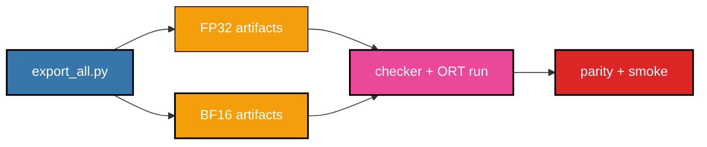

# 📦 Exporting And Validation

## 🎯 Export Scope

The export target is four neural ONNX modules:

- `AudioVAEEncoder`
- `AudioVAEDecoder`
- `VoxCPM2Prefill`
- `VoxCPM2DecodeChunk`

Host code remains responsible for text normalization, tokenization, WAV I/O, resampling, prompt/reference orchestration, random diffusion noise, decode loop, stop policy, and WAV writing.

## 📏 Required Rules

- Use `torch.onnx.export(..., dynamo=True)`.
- Save large weights with `external_data=True`.
- Do not apply graph optimization or quantization during export.
- Do not merge all modules into one ONNX graph.
- Preserve multilingual path.
- Preserve reference-audio path.
- Do not hardcode language.
- Do not simplify model math unless a blocker is documented first.
- Keep FP32 and BF16 public graph contracts identical.
- Use the fixed-capacity decode cache contract from `docs/architecture.md`.

## 🗂️ Artifact Layout

```text
models/
└── onnx/
    ├── fp32/
    │   ├── audio_vae_encoder/
    │   │   ├── audio_vae_encoder.onnx
    |   |   └── audio_vae_encoder.onnx.data
    │   ├── audio_vae_decoder/
    │   │   ├── audio_vae_decoder.onnx
    |   |   └── audio_vae_decoder.onnx.data
    │   ├── prefill/
    │   │   ├── voxcpm2_prefill.onnx
    |   |   └── voxcpm2_prefill.onnx.data
    │   └── decode_chunk/
    │       ├── voxcpm2_decode_chunk.onnx
    |       └── voxcpm2_decode_chunk.onnx.data
    └── bf16/
        └── ...
```

External data files must remain next to their `.onnx` files.

The shared source of truth for module names, paths, input/output contracts, precision profiles, and shape reports is `src/export/common.py`.

## Shape Profiles

Production exports default to `--shape-profile production`. This profile is shared by FP32 and BF16:

- static `batch=1`
- bounded dynamic Prefill sequence: `--max-seq-len 1024`
- bounded dynamic DecodeChunk cache: `--max-cache-seq-bound 6144`
- bounded dynamic AudioVAE encoder samples: `--max-samples 960000`
- bounded dynamic AudioVAE decoder latent steps: `--max-latent-steps 16384`

These are export contracts, not model-math changes. Runtime validates the same limits before calling ONNX so oversized inputs fail with a clear error. Use `--shape-profile flex` only for internal/debug exports that need the older broad dynamic behavior.

## 🚀 One-Command Export



Export production FP32:

```bash
python -B src/export/export_all.py --precision fp32
```

Export production BF16:

```bash
python -B src/export/export_all.py --precision bf16
```

Export both precision families with larger production bounds:

```bash
python -B src/export/export_all.py --precision fp32 --max-seq-len 1536 --max-cache-seq-bound 7680
python -B src/export/export_all.py --precision bf16 --max-seq-len 1536 --max-cache-seq-bound 7680
```

Equivalent console script after editable install:

```bash
voxcpm2-export --precision fp32
voxcpm2-export --precision bf16
```

Module-level exports:

```bash
python -B src/export/export_audio_vae_encoder.py --precision fp32
python -B src/export/export_audio_vae_decoder.py --precision fp32
python -B src/export/export_prefill.py --precision fp32 --mode plain_tts
python -B src/export/export_decode_chunk.py --precision fp32 --chunk-size 4 --current-length 16 --max-cache-seq 64
```

Use `--precision bf16` for the BF16 family.

## 🧩 Module Notes And Blockers

### AudioVAE Encoder

The ONNX wrapper exports `AudioVAE.encoder` only:

```text
AudioVAEEncoderWrapper.forward(waveform) -> latent
```

Blocked upstream helper logic is intentionally host-side:

- rank branch in `AudioVAE.encode()`
- Python padding math in `AudioVAE.preprocess()`
- dynamic right padding
- Python dict output from `CausalEncoder.forward()`

The wrapper requires padded rank-3 input and returns only `["mu"]`, matching the official encode output on preprocessed audio.

Known FP32 parity observation for `samples=20480`: max absolute diff around `8.6e-4`, mean absolute diff around `7.9e-5`. Default encoder parity tolerance is `1e-3`.

### AudioVAE Decoder

The decoder wrapper exposes:

- `latent`: `float32[batch, 64, latent_steps]`
- `sr_cond`: `int32[batch]`
- `waveform`: `float32[batch, 1, samples]`

No WAV writing, trimming, or resampling belongs in this graph.

### VoxCPM2 Prefill

The prefill wrapper exports only the non-iterative neural section from `VoxCPM2Model._inference()`:

1. feature encoder and `enc_to_lm_proj`
2. token embedding
3. text/audio embedding merge by masks
4. base MiniCPM full-prefix pass
5. FSQ replacement at audio positions
6. residual MiniCPM full-prefix pass
7. explicit K/V tensor cache outputs

Known risks:

- official `StaticKVCache` mutation is replaced by explicit tensor outputs
- prompt continuation Python list/split logic stays host-side
- MiniCPM returns cache as Python tuples, which the wrapper stacks immediately
- `scaled_dot_product_attention(enable_gqa=True)` is the main exporter/runtime risk
- LongRoPE dynamic indexing must stay documented if it fails export

### VoxCPM2 Decode Chunk

The decode-chunk wrapper exports a static chunk of exact neural steps. It does not capture the full host decode loop or stop policy.

The graph takes fixed-capacity cache tensors, valid lengths, and host-supplied diffusion noise for `chunk_size=4`. It returns chunk K/V updates, per-step stop logits, final hidden states, and next lengths.

`inference_timesteps` is fixed at export time for each internal CFM/LocDiT solve. It does not fix the number of outer autoregressive steps.

`VoxCPM2DecodeStep` remains available as an internal one-step export/parity utility. Production runtime and `export_all.py` use `VoxCPM2DecodeChunk`.

## 🛠️ Runtime Checkers

After export, run path-based ONNX checker and one ORT CPU invocation per module:

```bash
python -B src/runtime/run_audio_vae_encoder_ort.py --onnx-path models/onnx/fp32/audio_vae_encoder/audio_vae_encoder.onnx
python -B src/runtime/run_audio_vae_decoder_ort.py --onnx-path models/onnx/fp32/audio_vae_decoder/audio_vae_decoder.onnx
python -B src/runtime/run_prefill_ort.py --onnx-path models/onnx/fp32/prefill/voxcpm2_prefill.onnx --mode plain_tts
python -B src/runtime/run_decode_chunk_ort.py --onnx-path models/onnx/fp32/decode_chunk/voxcpm2_decode_chunk.onnx --chunk-size 4 --cache-seq 16 --max-cache-seq 64
```

Each checker logs input names, output names, dtype, dynamic/static dims, CPU providers, and compact output statistics. Large models must use path-based `onnx.checker.check_model(str(path))`.

## ⚖️ Parity Checks

Run PyTorch-wrapper vs ONNX Runtime CPU checks:

```bash
python -B tests/parity/test_audio_vae_encoder.py --onnx-path models/onnx/fp32/audio_vae_encoder/audio_vae_encoder.onnx
python -B tests/parity/test_audio_vae_decoder.py --onnx-path models/onnx/fp32/audio_vae_decoder/audio_vae_decoder.onnx
python -B tests/parity/test_prefill.py --onnx-path models/onnx/fp32/prefill/voxcpm2_prefill.onnx
python -B tests/parity/test_decode_chunk.py --onnx-path models/onnx/fp32/decode_chunk/voxcpm2_decode_chunk.onnx --precision fp32 --chunk-size 4 --cache-seq 16 --max-cache-seq 64
```

PyTest environment-variable form:

```bash
VOXCPM2_AUDIO_VAE_ENCODER_ONNX=models/onnx/fp32/audio_vae_encoder/audio_vae_encoder.onnx python -B -m pytest tests/parity/test_audio_vae_encoder.py
VOXCPM2_AUDIO_VAE_DECODER_ONNX=models/onnx/fp32/audio_vae_decoder/audio_vae_decoder.onnx python -B -m pytest tests/parity/test_audio_vae_decoder.py
VOXCPM2_PREFILL_ONNX=models/onnx/fp32/prefill/voxcpm2_prefill.onnx python -B -m pytest tests/parity/test_prefill.py
VOXCPM2_DECODE_CHUNK_ONNX=models/onnx/fp32/decode_chunk/voxcpm2_decode_chunk.onnx python -B -m pytest tests/parity/test_decode_chunk.py
```

## 💨 Runtime Smoke

```bash
python -B tests/smoke/test_cpu_only_runtime.py
```

Expected after models are exported:

```text
cpu_only_runtime_smoke=ok
```

On a clean checkout without exported models, the pytest version skips this smoke instead of failing:

```bash
python -B -m pytest tests/smoke/test_cpu_only_runtime.py
```

## ✅ Acceptance Criteria

- All four modules export for FP32 and BF16.
- ONNX checker passes for every graph.
- ONNX Runtime CPU creates every session.
- Public contracts match `src/export/common.py`.
- FP32 parity exists for every module.
- BF16 parity exists with explicit tolerances before production signoff.
- Missing unsupported ops or required math changes are documented before implementation continues.
