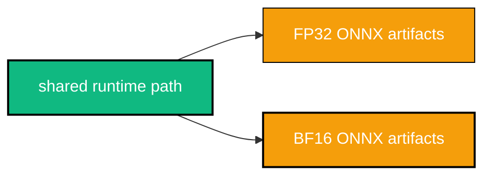
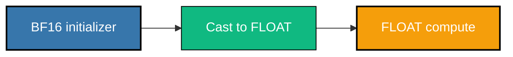
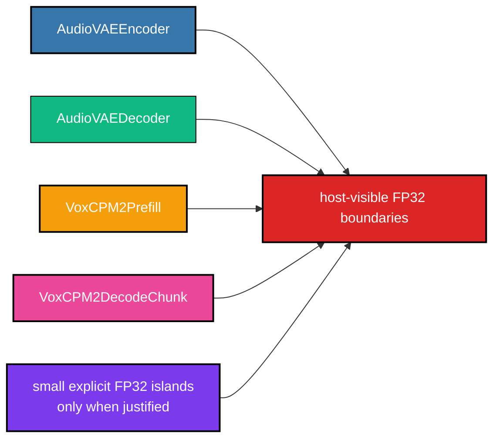

# 🎯 Precision Strategy

## Production Targets

The project has two production artifact families:


FP32 is the correctness anchor. BF16 is the production performance target and must stay feature-equivalent to FP32; it is not a storage-only final state.

Both families must use:

- the same module boundaries
- the same input/output names
- the same host-visible ranks and dynamic axes
- the same production shape profile
- the same fixed-capacity cache/state contract
- the same runtime path
- the same feature coverage
- the same benchmark and quality case matrix

## 📋 Precision Profiles

The profile registry is in `src/export/common.py`.

| profile | compute dtype | host-visible float dtype | role |
|---|---|---|---|
| `fp32` | `float32` | `float32` | correctness anchor |
| `bf16` | `bfloat16` | `float32` | production BF16 compute target |

Host-visible floating tensors remain FP32 for both profiles. This keeps the runtime path identical and localizes precision decisions inside export wrappers and graph metadata.

## Shape Policy

Precision and shape are independent policies. The production shape profile applies identically to FP32 and BF16:

- static `batch=1`
- bounded prompt/reference/prefill sequence
- bounded decode cache capacity
- bounded AudioVAE encoder and decoder time axes

Changing a bound requires re-exporting both precision families with the same shape flags and passing matching runtime bounds. It must not create separate FP32/BF16 runtime logic.

## 🧠 BF16 Compute Policy

Production BF16 must:

- use BF16 weights and activations where ONNX Runtime CPU has correct and performant kernels
- keep FP32 islands explicit and justified
- minimize BF16-to-FP32 and FP32-to-BF16 casts
- keep feature coverage identical to FP32
- compare quality/performance against FP32 ONNX and the official VoxCPM2 API

Allowed mixed-precision reasons:

- no usable ORT CPU BF16 kernel for an op on target platforms
- numerical instability exceeds accepted tolerance
- the shared FP32 host-visible boundary requires an explicit cast

Forbidden as production BF16 is an unscoped storage-only graph where BF16 initializers are immediately cast back to FLOAT and the graph effectively computes in FP32 by default:



That pattern gives no BF16 compute benefit and must stay under `artifacts/experiments`, not `models/onnx/bf16`.

Allowed in production BF16 are explicit ORT CPU compatibility islands around individual unsupported op types. These islands are graph-edge fixes, not alternate model math. They are required today because ONNX checker accepts BF16 graphs that stock ONNX Runtime CPU rejects during session creation for several common operators.

Current ORT CPU compatibility islands are inserted by `src/export/common.py::apply_bf16_ort_cpu_compatibility_pass()` during BF16 export. The pass keeps public inputs/outputs FP32, keeps cache/state semantics unchanged, and casts only the documented operator edges needed for ORT CPU load/run.

## 🧩 Module BF16 Regions



| module | BF16 compute candidates | FP32 islands | boundary casts |
|---|---|---|---|
| `AudioVAEEncoder` | non-convolution activation/mixing regions | `Pad`, `Conv`, `Sin`, selected elementwise ops | waveform FP32 -> BF16, latent BF16 -> FP32, island edge casts |
| `AudioVAEDecoder` | non-convolution activation/mixing regions | `Pad`, `Conv`, `ConvTranspose`, `Sin`, selected elementwise ops | latent FP32 -> BF16, waveform BF16 -> FP32, island edge casts |
| `VoxCPM2Prefill` | feature encoder, text embedding, base LM, FSQ/fusion, residual LM where ORT CPU supports BF16 | `MatMul`, `Gemm`, `Expand`, `Round`, `Sigmoid`, selected elementwise ops | masks/audio FP32 -> BF16, hidden/cache BF16 -> FP32, island edge casts |
| `VoxCPM2DecodeChunk` | DiT/LocDiT/CFM, feature encoder, base/residual LM, stop head regions where ORT CPU supports BF16 | rotary multiply/add, `MatMul`, `Gemm`, `Where`, `IsNaN`, `Expand`, `Cos`, `Sin`, `Round`, selected elementwise ops | hidden/cache/noise/cfg FP32 -> BF16, chunk outputs BF16 -> FP32, island edge casts |

The island list is deliberately explicit. If a future ORT CPU build gains a correct BF16 kernel for one of these ops, remove that op from the compatibility pass, re-export both production artifacts, and rerun parity/benchmark checks.

## Current BF16 Performance Blocker

The official VoxCPM2 CPU path runs the model with `dtype=bfloat16`. The ONNX target must match that direction, but stock `onnxruntime` CPU currently lacks usable BF16 kernels for key hot-path ops in these exported graphs. The concrete failures found from local re-export logs were:

| module | ORT CPU BF16 load blocker before compatibility pass |
|---|---|
| `AudioVAEEncoder` | `Conv` input typed BF16 |
| `AudioVAEDecoder` | `Conv` / `ConvTranspose` input typed BF16 |
| `VoxCPM2Prefill` | `Round`, then `Expand` / `Sigmoid` style typed edges |
| `VoxCPM2DecodeChunk` | `Cos`, `Where`, `IsNaN`, and large MatMul/Gemm-related regions |

The compatibility pass makes the BF16 artifacts loadable and runnable on `CPUExecutionProvider`, but it also documents why matching the official API wall time is not guaranteed with stock ORT CPU. API-level BF16 performance requires one of:

- ORT CPU kernels for the listed BF16 op classes on the target platforms
- a custom ORT build/provider with those kernels
- a different CPU backend that can execute the same ONNX contract without forcing the hot path back to FP32

## 🧹 Dtype Cleanup Policy

No-op casts are not allowed in production exports. Export wrappers must skip dtype conversion when the tensor already has the target dtype.

Cleanup classification:

| class | policy |
|---|---|
| redundant cast chains | remove when they come from no-op wrapper casts or same-dtype `Cast -> Cast` edges |
| FP32/BF16 ping-pong | production BF16 blocker unless it is a documented ORT CPU compatibility island |
| unavoidable boundaries | allowed only at shared FP32 host-visible graph boundaries |
| exporter artifacts | track `CastLike` and generated casts separately before changing model math |

The current wrappers use `src/export/common.py::cast_tensor_if_needed()` so FP32 exports do not emit no-op graph-edge casts while BF16 keeps intentional boundary casts.

Graph-level Cast summary:

```bash
python -B tools/profile/summarize_dtype_casts.py \
  --after-root models/onnx \
  --profile-json artifacts/profile/parsed_hotspots.json \
  --json-report artifacts/reports/dtype_cleanup_casts.json \
  --markdown-report artifacts/reports/dtype_cleanup_casts.md
```

If pre-cleanup artifacts were archived:

```bash
python -B tools/profile/summarize_dtype_casts.py \
  --before-root artifacts/pre_dtype_cleanup/onnx \
  --after-root models/onnx \
  --profile-json artifacts/profile/parsed_hotspots.json \
  --json-report artifacts/reports/dtype_cleanup_casts.json \
  --markdown-report artifacts/reports/dtype_cleanup_casts.md
```

## 🗃️ Legacy BF16 Storage Experiment

`src/experiments/bf16_feasibility.py` is retained only for historical storage feasibility analysis.

It can:

- inspect initializer dtypes and logical bytes
- find Cast nodes and direct Cast chains
- compare model size before/after copied BF16 initializers
- write experimental storage-only copies under `artifacts/experiments/bf16_storage_only`

It must not write production files under `models/onnx/bf16`.

Analyze existing FP32 artifacts:

```bash
python -B src/experiments/bf16_feasibility.py --mode analyze
```

Create separate storage-only experimental copies:

```bash
python -B src/experiments/bf16_feasibility.py \
  --mode convert \
  --models audio_vae_encoder audio_vae_decoder \
  --output-dir artifacts/experiments/bf16_storage_only \
  --report-json artifacts/reports/bf16_feasibility/audio_vae_partial_bf16_report.json \
  --check-ort
```

Historic finding: storage-only conversion roughly halves large initializer bytes but adds many BF16-to-FP32 Cast nodes. That is useful for disk-size analysis, not production compute.

## 🔬 Verification

Static precision policy tests:

```bash
python -B -m pytest tests/export/test_export_contract_consistency.py tests/export/test_dtype_cleanup.py tests/parity/test_bf16_compute_path.py
```

After BF16 export, check that storage-only patterns are not used as the primary graph strategy and that any ping-pong comes from documented ORT CPU islands:

```bash
VOXCPM2_BF16_ONNX_PATHS="models/onnx/bf16/audio_vae_encoder/audio_vae_encoder.onnx:models/onnx/bf16/audio_vae_decoder/audio_vae_decoder.onnx:models/onnx/bf16/prefill/voxcpm2_prefill.onnx:models/onnx/bf16/decode_chunk/voxcpm2_decode_chunk.onnx" \
python -B -m pytest tests/parity/test_bf16_compute_path.py
```

Windows PowerShell uses `;` instead of `:` in `VOXCPM2_BF16_ONNX_PATHS`.

## ✅ Final Acceptance Criteria

- Optimized FP32 artifacts exist for all four modules.
- Production BF16 artifacts exist for all four modules and are the primary performance target.
- Both families load with ONNX Runtime CPU only.
- Both families use the same runtime path and feature matrix.
- FP32 and BF16 have module-level parity reports.
- FP32 and BF16 have end-to-end quality reports against official VoxCPM2 API on CPU.
- FP32 and BF16 have CPU performance baseline reports against official VoxCPM2 API.
- BF16 reports show minimized Cast/CastLike overhead, document every required ORT CPU compatibility island, and clearly separate stock-ORT blockers from model-quality issues.
